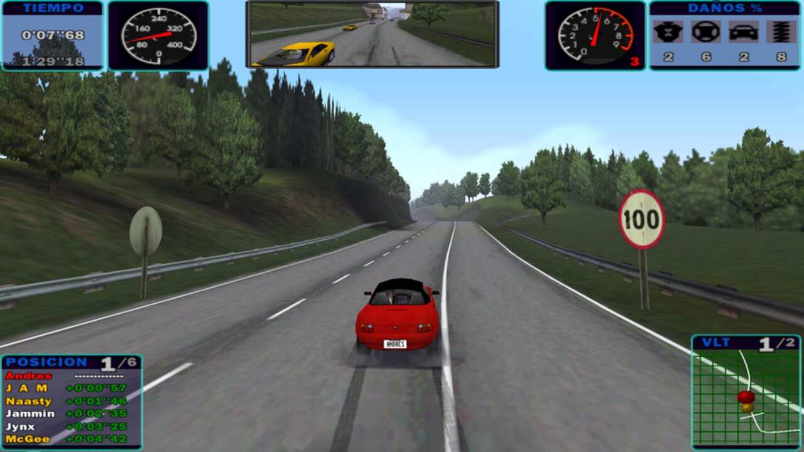

# Need For Speed IV: High Stakes en Linux

**NFS IV (1999) funcionando en Linux moderno con Wine: en español, a 1920x1080 y en 16:9 real.**



```bash
./instalar.sh /ruta/a/NFS4.bin      # el juego, en un comando
./scripts/instalar-widescreen.sh    # el 16:9, opcional
```

En Europa el juego se llamó **Need for Speed: Road Challenge**. Es el mismo.

---

## Índice

- [Estado](#estado) · [Descargas](#descargas) · [Requisitos](#requisitos) · [Instalación](#instalación)
- [Cómo se juega](#cómo-se-juega) · [Ajustes dentro del juego](#ajustes-dentro-del-juego)
- [Por qué funciona así](#por-qué-funciona-así) · [Lo que NO funciona](#lo-que-no-funciona)
- [Problemas](#problemas) · [Límites reales](#límites-reales)

---

## Estado

Verificado el 8 de agosto de 2026: instalado, jugado y confirmado por el usuario.

| | |
|---|---|
| SO | Ubuntu 26.04, Plasma 6.6 **Wayland** |
| Wine | 11.0 estable (WoW64, **sin librerías de 32 bits**) |
| GPU | Intel Iris Xe (i5-1235U) — **GPU al 10-15%** en carrera |
| Juego | NFS IV: High Stakes 1999, edición norteamericana (En, Es) |
| Parches | Modern Patch v0.1.0 (VEG) + SilentPatchNFS90s BUILD-1 |
| Renderizador | nGlide (el que trae el parche) |
| Imagen | 1920x1080, **16:9 real** — o 4:3 escalado, a elegir |
| Idioma | Español, textos y voces |
| Guardado | Correcto |

---

## Descargas

Todo lo que usa esta guía, con su verificación. Los instaladores descargan y comprueban esto solos; la tabla está aquí por si prefieres hacerlo a mano o los enlaces cambian.

| Qué | Dónde | Tamaño y verificación |
|---|---|---|
| **Imagen del CD** (En, Es) | [archive.org/details/need-for-speed-high-stakes-usa-en-es-rerelease-2002-08-19](https://archive.org/details/need-for-speed-high-stakes-usa-en-es-rerelease-2002-08-19) → `Need for Speed - High Stakes (USA) (En,Es).zip` | 570.629.221 B · MD5 `3e924b94d20a0304908b7e17fcebc946` |
| **Modern Patch** de VEG | [veg.by/files/nfs4/nfs4_modern_patch.7z](https://veg.by/files/nfs4/nfs4_modern_patch.7z) · [página](https://veg.by/en/projects/nfs4/) | 1.377.052 B |
| **SilentPatchNFS90s** | [github.com/CookiePLMonster/SilentPatchNFS90s](https://github.com/CookiePLMonster/SilentPatchNFS90s/releases/download/BUILD-1/SilentPatchNFS90s.zip) | 1.122.658 B |
| **Widescreen 16:9** (Ravage) | [nfsaddons.com, ficha 8133](https://www.nfsaddons.com/downloads/nfshs/tools/8133/nfshs-collisiontoggleexe-for-need-for-speed-4-modern-patch.html) | 5.176.055 B · SHA-256 `2cf118c339081135ff323cc4b2f4bde94825952bc019786892aed5b924a2f4d1` |
| Widescreen, *fallback* | [mirror en gamepressure](https://www.gamepressure.com/download/need-for-speed-4-high-stakes-widescreen-fix-v10-mod/zd12a4e) · [copia en Wayback](https://web.archive.org/web/20230928002629id_/https://gitlab.com/fkrull/porsche-graphics-hacks/uploads/1c30e98fef2ff897e9c5957a82bd0cb4/nfshs-widescreen-1.0.zip) | El GitLab original de Felix Krull está caído desde 2024 |

Notas sobre las descargas:

- **`veg.by` sirve una cadena TLS incompleta.** Cualquier descarga falla con *"unable to get local issuer certificate"* salvo con `curl -k`. El instalador lo hace a propósito y compara el tamaño exacto; no lo "arregles".
- **nfsaddons protege la descarga con un token de un solo uso** incrustado en la página. El instalador lo extrae al vuelo.
- **El ZIP del juego contiene un BIN/CUE de redump** (sectores crudos de 2352 bytes), no una ISO: `7z` y `mount -o loop` fallan con él. El instalador lo convierte con `bchunk`; pásale directamente el `.bin`.
- **Este repositorio no distribuye el juego**, solo scripts y documentación.

### Sobre el español: no existe versión latina

Si buscas el doblaje latino, ahórrate el tiempo. EA encargó **un solo doblaje al español** —castellano, grabado en Madrid— y lo metió en todas las ediciones.

Comprobado, no supuesto: los 16 archivos de voz de `DATA/AUDIO/SPEECH/SPANISH/` del disco americano `(USA) (En,Es)` y del europeo `Road Challenge (En,Es,Sv)` coinciden **byte a byte**.

```
$ md5sum eu/PGNORMSP.BNK usa/PGNORMSP.BNK
f8634c4abbaf36cef0971750a8fd6d65  eu/PGNORMSP.BNK
f8634c4abbaf36cef0971750a8fd6d65  usa/PGNORMSP.BNK
```

Da igual cuál uses: el americano pesa menos, el europeo añade sueco.

**El juego no se puede comprar.** No está en GOG, ni Steam, ni la EA App, y EA nunca lo relanzó. La única compra legítima es el CD físico de segunda mano.

---

## Requisitos

**Wine 11 del repositorio oficial**, no el de tu distribución:

```bash
sudo dpkg --add-architecture i386
sudo mkdir -pm755 /etc/apt/keyrings
sudo wget -O /etc/apt/keyrings/winehq-archive.key https://dl.winehq.org/wine-builds/winehq.key
sudo wget -NP /etc/apt/sources.list.d/ https://dl.winehq.org/wine-builds/ubuntu/dists/$(lsb_release -cs)/winehq-$(lsb_release -cs).sources
sudo apt update && sudo apt install --install-recommends winehq-stable
sudo apt install p7zip-full curl bchunk xdotool imagemagick
```

Wine 11 trae los binarios PE de 32 bits del nuevo WoW64, así que **no hacen falta paquetes i386 de Wine** aunque el juego sea de 32 bits — WineHQ ni siquiera los publica ya para Ubuntu 26.04. `xdotool` e `imagemagick` los usa el vigilante del lanzador.

---

## Instalación

```bash
git clone https://github.com/andresgarcia0313/nfs4-wine-linux.git
cd nfs4-wine-linux
./instalar.sh ~/Descargas/"Need for Speed - High Stakes (USA) (En,Es).bin"
./scripts/instalar-widescreen.sh        # opcional, para el 16:9
```

Instala en `/opt/games/Need For Speed IV High Stakes` salvo que indiques otro destino como segundo argumento. `/opt` y no `$HOME` a propósito: son casi 2 GB.

El instalador convierte la imagen si hace falta, extrae los datos del CD, unifica los nombres a minúsculas, descarga y **verifica** los parches, configura el renderizador, crea el prefijo de Wine y deja el lanzador con su acceso directo.

El del widescreen se instala **en paralelo**: añade un `nfs4ws.exe` y no toca nada de lo anterior. Ambos modos conviven.

---

## Cómo se juega

```bash
jugar.sh          # 16:9 si instalaste el widescreen, 4:3 si no
jugar.sh --43     # fuerza el 4:3 original
```

Desde el **menú de aplicaciones** abre en 16:9; con clic derecho sobre el icono tienes **"Abrir en 4:3"**.

**Para salir usa `Alt+F4`** — y sal antes al menú, porque dentro de una carrera no responde. El botón *"Salir"* del juego deja el proceso vivo quemando un núcleo con la pantalla en negro: es un bug conocido sin arreglo, y el lanzador incluye un vigilante que lo detecta y lo remata en unos 8 segundos.

---

## Ajustes dentro del juego

**Pon esto**, sobre todo con el widescreen:

| Ajuste | Valor |
|---|---|
| Gráficos → Wide Screen | **Off** (el 16:9 ya lo aplica el ejecutable; activarlo lo duplica) |
| Gráficos → Ajustes avanzados → View Angle | **Wide** |
| Cámaras → Cámara 1 | **High** |

**No toques esto, bajo ningún concepto:**

- **La resolución.** Rompe el juego con `AMF=5 screen.c(563)` **y el ajuste queda grabado en `savedata/config.dat`**, así que falla en todos los arranques siguientes aunque reinstales. Es el error más caro de esta guía.
- **El Triple Buffer** (mismo fallo) y el **Z-Buffer**.
- **F11 / F12** durante la partida: rompen la corrección de aspecto.

**Si ya te ha pasado** — no pierdes progreso ni coches, eso vive en `savedata/DB/`:

```bash
pkill -x nfs4.exe; pkill -x nfs4ws.exe; wineserver -k
rm "/opt/games/Need For Speed IV High Stakes/savedata/config.dat"
```

---

## Por qué funciona así

Cuatro decisiones sostienen todo lo demás. Si solo lees una sección, que sea esta.

### 1. No ejecutes el instalador del CD

El disco lleva **SafeDisc 1.06** y su instalador es de 16 bits: no arranca en ningún sistema de 64 bits. **El Modern Patch de VEG vuelve el juego portable**: copias `DATA` y `SAVEDATA`, descomprimes el parche encima y ya está. Trae un `nfs4.exe` limpio basado en la versión 4.50. Sin instalador, sin registro de Windows, sin no-CD que buscar.

### 2. Usa `nglide`, y no lo actualices

Es el único renderizador que escala el menú de 640x480 a la pantalla completa respetando la proporción. El escalado se activa en `drivers/nglide/thrash.ini`, **no en variables de entorno** — el parche las sobrescribe al cargar `glide3x.dll`:

```ini
[ENV]
NGLIDE_RESOLUTION=1
NGLIDE_ASPECT=1
```

**No sustituyas el `glide3x.dll` del parche por nGlide 2.10**, aunque el instalador oficial de Lutris lo haga y el del parche sea de 2016. Medido en una Iris Xe: **el juego va más lento con el 2.10 incluso en la resolución más baja**. El de VEG está afinado para este motor; el genérico no. Sí desbloquea resoluciones de render de hasta 1600x1200 (el parche se queda en 640x480), pero no compensa.

### 3. Carga SilentPatch con un override

El `dinput.dll` de SilentPatch no es DirectInput: es *Ultimate ASI Loader*, y bajo Wine no se carga solo.

```bash
export WINEDLLOVERRIDES="mscoree,mshtml=;dinput=n,b"
```

Sin `dinput=n,b`, SilentPatch queda inerte y `SingleProcAffinity=1` pasa a atenderlo la implementación del Modern Patch, que **ata todo el proceso a un solo núcleo** en vez de solo los hilos problemáticos. Pagas el coste sin el beneficio, y ningún síntoma visible lo delata. SilentPatch además arregla el polling del mando, que es justo lo que se rompe bajo Wine.

### 4. El 16:9 lo da el ejecutable, no el renderizador

Esto es lo contraintuitivo, y saberlo ahorra una tarde entera.

Comparado byte a byte, el `nfs4.exe` de Ravage se diferencia del que trae el Modern Patch en **9 bytes**. Tres de ellos son un único número decimal: la constante que convierte grados a radianes, multiplicada por 1,177. **Todo el widescreen es eso**: ampliar el ángulo de visión.

El segundo componente es un DLL que se hace pasar por renderizador, corrige la proporción y delega en el Glide real. Resultó ser, byte a byte, el *widescreen fix* de **Felix Krull** — cuyo repositorio de GitLab lleva caído desde 2024 y sobrevive dentro de este paquete. Su autor recomienda **expresamente usarlo con nGlide**.

Conclusión: **funciona con el `glide3x.dll` que ya tienes**. No necesita dgVoodoo, ni DirectX 9, ni D7VK.

---

## Lo que NO funciona

Nueve combinaciones probadas antes de dar con la buena. Se publican para que nadie repita el camino:

| Renderizador | Driver de Wine | Extra | Resultado |
|---|---|---|---|
| **nglide** | **x11** | — | **Funciona** (4:3, y 16:9 con el fix) |
| nglide | wayland | — | Funciona, sin ventaja |
| dx7 | x11 | — | Render en un recuadro arriba a la izquierda + artefactos de transparencia |
| dx7 | wayland | — | Pantalla negra |
| dx8 | wayland | — | Pantalla negra |
| dx7 | x11 | `EmulateModeset=Y` | Pantalla negra |
| dx7 | x11 | D7VK 2.0 | Dibuja, sigue en el recuadro |
| dx7 | wayland | D7VK 2.0 | El proceso se cierra solo |
| nglide 2.10 | x11 | — | Funciona pero **más lento**, incluso a 640x480 |

Dos causas de fondo lo explican:

- **La API Glide no tiene ni un solo modo 16:9.** Es todo 4:3 y 5:4. NFS III lo esquiva con una extensión propietaria que el autor de nGlide programó a medida para VEG en 2015; **NFS IV nunca la usa**.
- **El driver X11 de Wine no escala**: marca la ventana como pantalla completa y espera un cambio de modo real por XRandR que bajo XWayland nunca ocurre. De ahí el recuadro. El driver Wayland sí escala, pero con él los renderizadores Direct3D se quedan en negro.

---

## Problemas

| Síntoma | Causa | Solución |
|---|---|---|
| **`AMF=5 screen.c(563)` y salida al escritorio** | Subir la resolución desde el menú, o el Triple Buffer. Queda grabado en `config.dat` y falla para siempre | Borra `savedata/config.dat`. El progreso no se pierde |
| `could not load kernel32.dll, status c0000135` | El juego es PE32 y el prefijo no tiene `syswow64` poblado | `ls $WINEPREFIX/drive_c/windows/syswow64/ \| wc -l` debe dar cientos. Si da 0, borra el prefijo y recréalo **sin interrumpir** |
| El arranque se queda colgado | El instalador de Wine Mono espera a que cierres su diálogo | `WINEDLLOVERRIDES="mscoree,mshtml="` |
| **Se congela al entrar al menú principal** | Bug de hilos en el decodificador de vídeo. Es el fallo característico de NFS4 | `NoMovies=1` en `nfs4.ini`, o renombra `data/movies` |
| El juego muere solo a los ~30 segundos | Vigilante mal calibrado: los vídeos de intro arrancan en negro y disparan su condición | Ya resuelto — el vigilante no se arma hasta ver un fotograma con contenido. Actualiza `jugar.sh` |
| **Pantalla negra al pulsar "Salir"** | El juego deja de dibujar pero no muere | Cierra con `Alt+F4`, saliendo antes al menú. El vigilante lo remata en ~8 s |
| «The game is already running» | Proceso huérfano | `pkill -x nfs4.exe; pkill -x nfs4ws.exe; wineserver -k` |
| No guarda partidas | Los archivos del CD vienen en solo lectura | `find "$DEST" -xdev -type f -exec chmod 644 {} +` |
| KDE roba el teclado o el ratón a pantalla completa | Gestor de ventanas | `wine reg add 'HKCU\Software\Wine\X11 Driver' /v GrabFullscreen /t REG_SZ /d Y /f` |
| `STREAM - unable to open file 'Data\Audio\Music\menu1.asf'` | Se usó el instalador del juego, que no copia todo el CD | Copia `DATA` y `SAVEDATA` completos, incluidos `audio/music` y `movies` |
| Los faros iluminan las costuras de los polígonos | Bug del motor, agravado por dgVoodoo | Faros en *vertex* en vez de *projected*. Con nGlide no aparece |
| Se pierden las asignaciones del mando | El juego las descarta si arranca sin el mando conectado | Conecta el mando **antes** de lanzar el juego, siempre |
| Crash al añadir coches | Límite duro del motor | No superes los **50 coches** |

### Errores frecuentes

- Copiar los binarios del CD **encima** del parche: revierte `nfs4.exe` y `eacsnd.dll` en silencio.
- Dejar mezclados `DATA/MENUS` y `data/menus`: en Linux son dos árboles distintos y el juego lee solo uno. El instalador los unifica a minúsculas por eso, y es el problema que reportó el único usuario que había documentado esto en Linux.
- Instalar los `.exe` de coches oficiales de EA: exigen entradas de registro que en una instalación portable no existen. Hay que extraerlos y copiar las carpetas a mano.
- Empezar por el HD Mod Pack o por la ruta dgVoodoo + DirectX 9: no arranca bajo Wine WoW64. Deja el juego funcionando primero.

---

## Límites reales

Para no perseguir imposibles:

- **El motor va a 64 FPS por diseño.** Subir resolución solo puede quitarte fluidez, nunca darte más.
- **El HUD y los marcadores salen algo más anchos en 16:9.** Son elementos 2D y el estirado los alcanza. No tiene arreglo.
- **La pantalla partida queda mal ajustada** con el widescreen.
- **El multijugador online** usa DirectPlay y el servicio de EA cerró hace años.
- **El juego no cierra limpiamente** bajo Wine. De ahí el vigilante.
- **El Modern Patch de NFS4 está suspendido desde 2016** en la v0.1.0. No habrá más.

---

## Estructura del repositorio

```
instalar.sh                     Instalación completa en un comando
scripts/instalar-widescreen.sh  Widescreen 16:9 (opcional, en paralelo)
scripts/jugar.sh                Lanzador: 16:9 por defecto, --43 para el original
config/nfs4.ini                 Configuración verificada
config/nglide-thrash.ini        Escalado del renderizador
```

---

## Créditos

- **[VEG](https://veg.by/en/projects/nfs4/)** — Modern Patch. Sin él el juego no arranca en un sistema moderno.
- **[CookiePLMonster](https://github.com/CookiePLMonster/SilentPatchNFS90s)** — SilentPatch NFS90s.
- **Felix Krull** — *widescreen fix*, la pieza que hace posible el 16:9. Su repositorio ya no existe.
- **Ravage** y **AuToMaNiAk005** — los ejecutables con el ángulo de visión ampliado.
- **[Zeus Software](https://www.zeus-software.com/downloads/nglide)** — nGlide.
- **[PCGamingWiki](https://www.pcgamingwiki.com/wiki/Need_for_Speed:_High_Stakes)** — documentación de referencia.

Need for Speed IV: High Stakes es propiedad de Electronic Arts. Este repositorio contiene únicamente scripts y documentación.

## Licencia

MIT.
