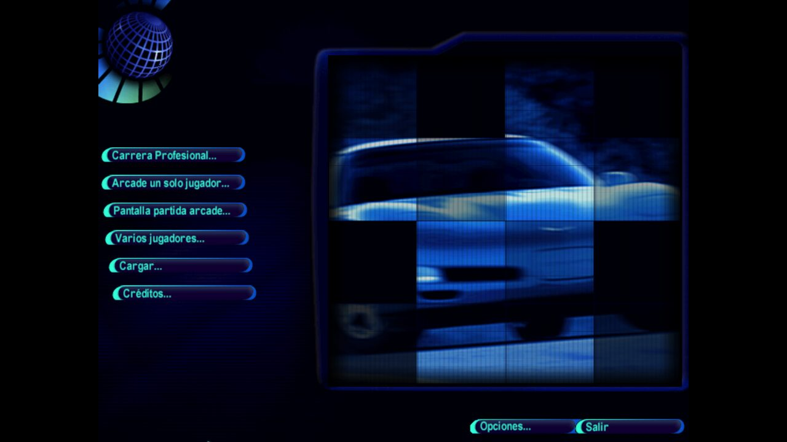
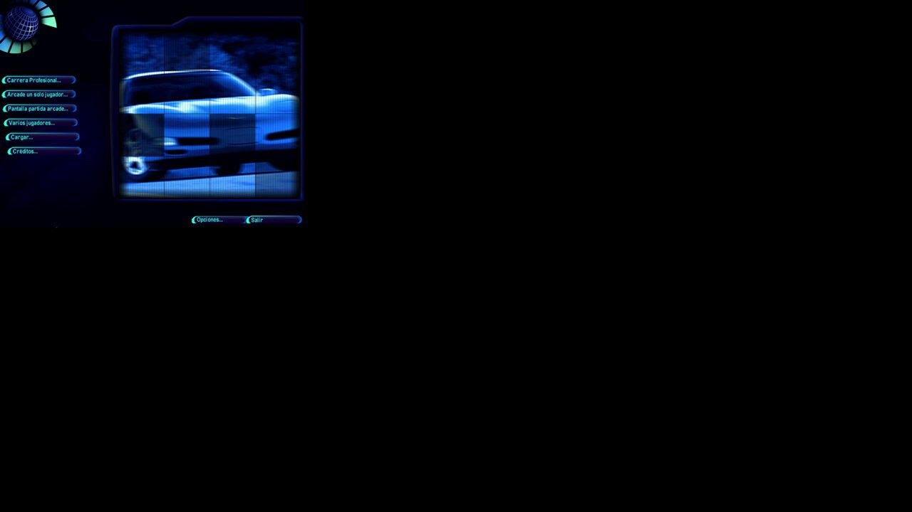
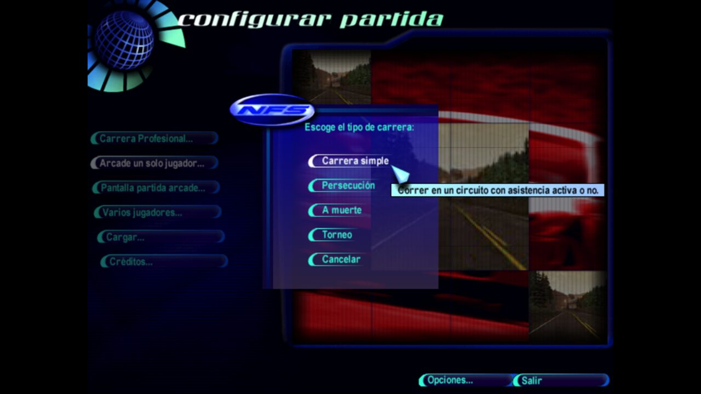
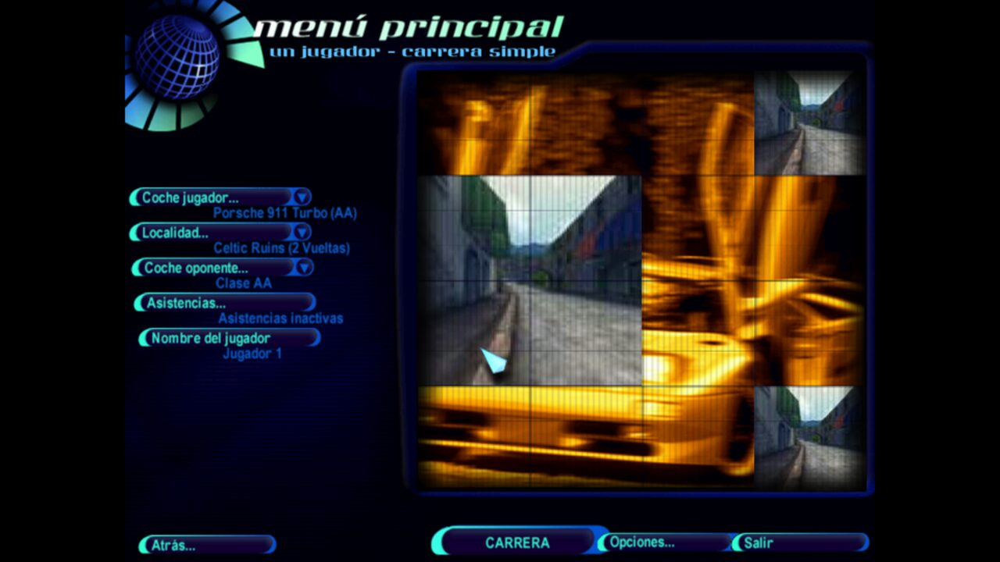

# Need For Speed IV: High Stakes en Linux

Instalación completa y funcional de **NFS IV: High Stakes (1999)** en Linux moderno con Wine, a 1920x1080 y en español.



**Un solo comando:**

```bash
./instalar.sh /ruta/a/NFS4.bin
```

---

## Estado

Verificado el 8 de agosto de 2026.

| Componente | Estado |
|---|---|
| SO | Ubuntu 26.04, Plasma 6.6 **Wayland** |
| Wine | 11.0 estable (WoW64, **sin librerías de 32 bits**) |
| GPU | Intel Iris Xe (i5-1235U) |
| Juego | NFS IV: High Stakes 1999, edición norteamericana (En, Es) |
| Modern Patch | v0.1.0 (VEG) |
| SilentPatch | NFS90s BUILD-1 |
| Renderizador | nGlide |
| Resolución | 1920x1080, proporción respetada |
| Idioma | Español (textos y voces) — ver nota abajo |
| Guardado de perfil | Correcto |

> En Europa este juego se llamó **Need for Speed: Road Challenge**. Es el mismo juego.

---

## Lo que necesitas

**1. Wine 11 del repositorio oficial**, no el de tu distribución:

```bash
sudo dpkg --add-architecture i386
sudo mkdir -pm755 /etc/apt/keyrings
sudo wget -O /etc/apt/keyrings/winehq-archive.key https://dl.winehq.org/wine-builds/winehq.key
sudo wget -NP /etc/apt/sources.list.d/ https://dl.winehq.org/wine-builds/ubuntu/dists/$(lsb_release -cs)/winehq-$(lsb_release -cs).sources
sudo apt update && sudo apt install --install-recommends winehq-stable
sudo apt install p7zip-full curl bchunk
```

> Wine 11 trae los binarios PE de 32 bits del nuevo WoW64, así que **no hacen falta paquetes i386 de Wine** aunque el juego sea de 32 bits. WineHQ ni siquiera los publica ya para Ubuntu 26.04.

**2. La imagen del CD.** El juego lleva descatalogado más de dos décadas: no está en GOG, ni en Steam, ni en la EA App, y EA nunca lo relanzó. La única compra legítima es el CD físico de segunda mano — búscalo como *"Road Challenge"* si estás en Europa.

La edición norteamericana incluye español (textos y voces) y está en Internet Archive:

- <https://archive.org/details/need-for-speed-high-stakes-usa-en-es-rerelease-2002-08-19> — `Need for Speed - High Stakes (USA) (En,Es).zip`, 570.629.221 bytes, MD5 `3e924b94d20a0304908b7e17fcebc946`

Dentro trae un **BIN/CUE de redump** (sectores crudos de 2352 bytes). El instalador lo convierte solo con `bchunk`; pásale directamente el `.bin`.

Este repositorio **no distribuye el juego**: solo los scripts y la documentación.

### Sobre el español: no existe versión latina

Si buscas el doblaje latino, ahórrate el tiempo: **no lo hay**. EA encargó **un solo doblaje al español** —castellano, grabado en Madrid— y lo metió tal cual en todas las ediciones.

Está comprobado, no supuesto: descargué el disco norteamericano `(USA) (En,Es)` y el europeo `Road Challenge (Europe) (En,Es,Sv)`, y los 16 archivos de voz de `DATA/AUDIO/SPEECH/SPANISH/` coinciden **byte a byte** en ambos.

```
$ md5sum eu/PGNORMSP.BNK usa/PGNORMSP.BNK
f8634c4abbaf36cef0971750a8fd6d65  eu/PGNORMSP.BNK
f8634c4abbaf36cef0971750a8fd6d65  usa/PGNORMSP.BNK
```

Da igual cuál de los dos uses. El americano pesa menos y solo trae inglés y español; el europeo añade el sueco.

---

## Instalación

```bash
git clone https://github.com/andresgarcia0313/nfs4-wine-linux.git
cd nfs4-wine-linux
./instalar.sh ~/Descargas/"Need for Speed - High Stakes (USA) (En,Es).bin"
```

Por defecto instala en `/opt/games/Need For Speed IV High Stakes`. Puedes indicar otro destino como segundo argumento.

El instalador: convierte la imagen si hace falta, extrae los datos del CD, unifica los nombres a minúsculas, descarga y verifica el Modern Patch, aplica SilentPatch, configura el renderizador, crea el prefijo de Wine y deja el lanzador con su acceso directo.

**Nada más terminar**, entra en *Opciones → Gráficos* y deja **Triple Buffer en No**. Ver más abajo por qué es lo primero que hay que hacer.

---

## Las cuatro decisiones que hacen que funcione

Si solo lees una sección, que sea esta.

### 1. No ejecutes el instalador del CD

El disco lleva **SafeDisc 1.06**, y su instalador es de 16 bits: no arranca en ningún sistema de 64 bits. **El Modern Patch de VEG vuelve el juego portable**: basta copiar `DATA` y `SAVEDATA` del CD y descomprimir el parche encima, que trae un `nfs4.exe` limpio basado en la versión 4.50. Sin instalador, sin registro de Windows, sin no-CD que buscar aparte.

### 2. Usa el renderizador `nglide`

El parche trae siete. La elección decide cómo se ve el juego:

| Valor | Veredicto |
|---|---|
| **`nglide`** | **El correcto.** Único que escala el menú a la resolución del escritorio respetando la proporción |
| `dx7` | Funciona, y es lo que recomienda el reporte Gold de WineHQ. Pero **deja el menú de 640x480 en una esquina** |
| `softtri` | Software. Feo pero casi infalible |
| `dx6`, `dx8`, `dgvoodoo` | Inestables bajo Wine |

Esta es la diferencia visible entre uno y otro:

| `nglide` | `dx7` |
|---|---|
|  |  |

Y el escalado se activa en `drivers/nglide/thrash.ini`, **no en variables de entorno** — el parche las sobrescribe al cargar `glide3x.dll`:

```ini
[ENV]
NGLIDE_RESOLUTION=1
NGLIDE_ASPECT=1
```

No instales nGlide por separado: el parche ya trae su propia versión.

### 3. Carga SilentPatch con un override

El `dinput.dll` que instala SilentPatch no es DirectInput: es *Ultimate ASI Loader*, y bajo Wine no se carga solo.

```bash
export WINEDLLOVERRIDES="mscoree,mshtml=;dinput=n,b"
```

Sin `dinput=n,b`, SilentPatch queda inerte y `SingleProcAffinity=1` pasa a atenderlo la implementación del Modern Patch, que **ata todo el proceso a un solo núcleo** en vez de solo los hilos problemáticos. Se paga el coste sin recibir el beneficio, y no hay ningún síntoma visible que lo delate. Además, SilentPatch arregla el polling del mando, que es justo lo que se rompe bajo Wine.

### 4. Apaga el Triple Buffer antes de nada

Es el fallo más citado de este juego y el más traicionero: con Triple Buffer activado el juego revienta con `AMF=5 screen.c(563)`, **y el ajuste queda grabado en `savedata/config.dat`**, así que a partir de ahí falla siempre, incluso reinstalando el ejecutable. Si ya te ha pasado: borra `savedata/config.dat` y vuelve a empezar.

---

## Capturas

| | |
|---|---|
|  |  |

---

## Solución de problemas

| Síntoma | Causa | Solución |
|---|---|---|
| **`AMF=5 screen.c(563)` y salida al escritorio** | Triple Buffering activado; queda grabado en `config.dat` | *Opciones → Gráficos → Triple Buffer = No*. Si ya falla siempre, **borra `savedata/config.dat`** |
| El juego no arranca con los ejecutables originales | SafeDisc 1.06 embebido | Instalación portable con Modern Patch (nunca el `.exe` del CD) |
| **Se congela al entrar al menú principal** | Bug de hilos en el decodificador de vídeo. Es el fallo característico de NFS4, no existe en NFS3 | `NoMovies=1` en `nfs4.ini`, o renombra `data/movies` |
| `could not load kernel32.dll, status c0000135` | El juego es PE32 y el prefijo no tiene `syswow64` poblado | `ls $WINEPREFIX/drive_c/windows/syswow64/ \| wc -l` debe dar cientos. Si da 0, borra el prefijo y recréalo **sin interrumpir** |
| El arranque se queda colgado | El instalador de Wine Mono espera a que cierres su diálogo | `WINEDLLOVERRIDES="mscoree,mshtml="` |
| El menú sale pequeño en una esquina | Renderizador `dx7`; el menú es de 640x480 por diseño | `ThrashDriver=nglide` + `NGLIDE_RESOLUTION=1` |
| Bloqueo o pantalla negra al cambiar la resolución desde el menú del juego | Bug conocido entre nGlide y Wine | Deja la resolución del juego como está y fuerza el tamaño desde `drivers/nglide/thrash.ini` |
| La pista no carga, o los FPS se desploman | Límite del motor con resoluciones altas | **No pases de 1280x960** |
| KDE roba el teclado o el ratón a pantalla completa | Gestor de ventanas | `wine reg add 'HKCU\Software\Wine\X11 Driver' /v GrabFullscreen /t REG_SZ /d Y /f` |
| `STREAM - unable to open file 'Data\Audio\Music\menu1.asf'` | Se usó el instalador del juego, que no copia todo el CD | Copiar `DATA` y `SAVEDATA` completos, incluidos `audio/music` y `movies` |
| **Pantalla negra al pulsar "Salir"** | El juego deja de dibujar pero no muere; se queda quemando un núcleo | **Cierra con `Alt+F4`**. El lanzador incluye un vigilante que lo detecta y lo remata en ~8 s |
| «The game is already running» | Proceso huérfano de un intento anterior | `pkill -x nfs4.exe && wineserver -k` |
| No guarda partidas | Los archivos del CD vienen en solo lectura | `find "$DEST" -xdev -type f -exec chmod 644 {} +` |
| Los faros iluminan las costuras de los polígonos | Bug del motor, agravado por dgVoodoo | Pon los faros en *vertex* en vez de *projected* |
| Se pierden las asignaciones del mando | El juego las descarta si arranca sin el mando conectado | Conecta el mando **antes** de lanzar el juego, siempre |
| Crash al añadir coches | Límite duro del motor | No superes los **50 coches** instalados |

### Errores frecuentes que conviene evitar

- Copiar los binarios del CD **encima** del parche: revierte `nfs4.exe` y `eacsnd.dll` en silencio.
- Dejar mezclados `DATA/MENUS` y `data/menus`: en Linux son dos árboles distintos y el juego lee solo uno. El instalador lo unifica a minúsculas por eso.
- Instalar los `.exe` de coches oficiales de EA: exigen las entradas de registro del instalador original, que aquí nunca se ejecuta. Hay que extraerlos y copiar las carpetas a mano.
- Subir la resolución "porque el monitor da más": por encima de 1280x960 el motor deja de cargar pistas.
- Empezar por el paquete widescreen o el HD Mod Pack: usan dgVoodoo + DirectX 9, y ese montaje no arranca bajo Wine WoW64. Deja el juego funcionando primero.

### Lo que no tiene arreglo

Limitaciones reales, para no perseguir imposibles: el juego está cableado a 4:3 y el Modern Patch nunca llegó a implementar widescreen (el proyecto está suspendido desde 2016); el motor va a 64 FPS por diseño; el multijugador online usa DirectPlay y el servicio de EA cerró hace años; y el juego no cierra limpiamente bajo Wine.

---

## Qué está verificado y qué no

Honestidad por delante:

- **Verificado**: instalación portable, arranque, menús completos en español, navegación por submenús, creación y guardado del perfil de jugador, escalado a 1920x1080, carga real de SilentPatch y de nGlide, y cierre limpio con `Alt+F4`.
- **No verificado**: una carrera completa jugada de principio a fin. La inyección de ratón sintético no llega al juego bajo Wayland, así que esa parte hay que probarla a mano. Con el ratón físico el juego responde con normalidad.

---

## Estructura del repositorio

```
instalar.sh                  Instalación completa en un comando
scripts/jugar.sh             Lanzador con el vigilante de salida
config/nfs4.ini              Configuración verificada
config/nglide-thrash.ini     Escalado del renderizador
```

---

## Créditos

- **[VEG](https://veg.by/en/projects/nfs4/)** — Modern Patch. Sin él el juego no arranca en un sistema moderno. El proyecto está suspendido y la v0.1.0 es lo último que existirá.
- **[CookiePLMonster](https://github.com/CookiePLMonster/SilentPatchNFS90s)** — SilentPatch NFS90s.
- **[Zeus Software](https://www.zeus-software.com/downloads/nglide)** — nGlide.
- **[PCGamingWiki](https://www.pcgamingwiki.com/wiki/Need_for_Speed:_High_Stakes)** y **[WineHQ AppDB](https://appdb.winehq.org/objectManager.php?sClass=application&iId=2811)** — documentación de referencia.

Need for Speed IV: High Stakes es propiedad de Electronic Arts. Este repositorio contiene únicamente scripts y documentación.

## Licencia

Scripts y documentación bajo licencia MIT.
